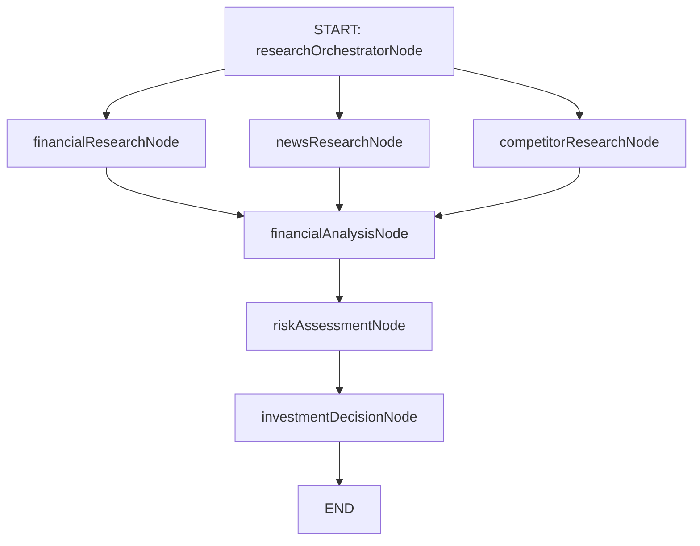

# 📈 EquityLens AI — Autonomous Investment Research Agent

<p align="center">
  <b>Real-time AI investment intelligence agent powered by LangGraph, Groq (Llama 3.3 70B), and Google Gemini 2.5 Flash.</b>
</p>

<p align="center">
  
  
  
  
  
</p>

---

## 📌 Table of Contents
- [Overview](#-overview)
- [Key Features](#-key-features)
- [How to Run](#-how-to-run)
- [Architecture & How It Works](#-architecture--how-it-works)
- [Key Decisions & Trade-offs](#-key-decisions--trade-offs)
- [Example Analysis Runs](#-example-analysis-runs)
- [Future Enhancements](#-future-enhancements)
- [Bonus Points: LLM Session Logs](#-bonus-points-llm-session-logs)

---

## 🔍 Overview

**EquityLens AI** is an autonomous, real-time investment research agent designed for institutional-grade equity evaluation. By entering any public company name or ticker symbol, the agent initiates a multi-stage parallel research workflow using **LangGraph.js**.

The system dynamically fetches real-time financial statements, extracts market news sentiment, maps key competitors, and synthesizes quantitative metrics into an actionable **INVEST**, **PASS**, or **HOLD** thesis with confidence scoring and risk analysis.

---

## ⚡ Key Features

- 🔄 **Real-Time Stage Streaming**: Live execution feedback over Server-Sent Events (SSE) as each graph node processes research tasks.
- 🤖 **Dual-LLM Intelligence**:
  - **Groq (Llama 3.3 70B)** for lightning-fast orchestration, web search structuring, and data extraction.
  - **Google Gemini 2.5 Flash** for deep financial analysis, risk assessment, and investment decision synthesis.
- 📊 **Financial Dashboard**: Interactive UI rendering historical revenue/net income charts, key metrics (P/E ratio, ROE, Debt-to-Equity, FCF), and categorized risk factors.
- 🛡️ **Nuanced 3-Tier Recommendation**: Uses **INVEST**, **PASS**, or **HOLD** (instead of forcing binary calls) to accurately reflect market uncertainty and valuation sensitivity.

---

## 🚀 How to Run

### 1. Prerequisites
Ensure you have **Node.js 18.x+** and **npm** installed on your system.

### 2. Installation
Clone the repository and install dependencies:
```bash
git clone https://github.com/Abhishek197088/AI-IIM-Investment-Intelligence.git
cd AI-IIM-Investment-Intelligence
npm install
```

### 3. Environment Setup
Create a `.env.local` file in the project root directory:
```bash
cp .env.example .env.local
```

Populate `.env.local` with your API keys:
```env
GOOGLE_API_KEY=your_google_gemini_api_key
GROQ_API_KEY=your_groq_api_key
TAVILY_API_KEY=your_tavily_api_key
FMP_API_KEY=your_financial_modeling_prep_key
DEMO_MODE=false
```
*(Tip: Set `DEMO_MODE=true` to test locally with mock responses without consuming API credits).*

### 4. Start the Application
Run the Next.js development server:
```bash
npm run dev
```
Open [http://localhost:3000](http://localhost:3000) in your web browser.

---

## 🏗️ Architecture & How It Works

The execution engine is built on **LangGraph.js** using a 7-node state graph with parallel research execution:



### Node Responsibilities
1. **`researchOrchestratorNode`**: Resolves company ticker symbol, exchange information, and queries general business background via Tavily API.
2. **Parallel Research Fan-Out**:
   - **`financialResearchNode`**: Pulls financial statements, historical revenue, margins, and ratios from Financial Modeling Prep (FMP) API.
   - **`newsResearchNode`**: Gathers recent news sentiment and key market announcements.
   - **`competitorResearchNode`**: Maps direct industry peers and market share dynamics.
3. **Analysis & Decision Fan-In**:
   - **`financialAnalysisNode`**: Synthesizes operational efficiency, capital allocation, and valuation multiples using Gemini 2.5 Flash.
   - **`riskAssessmentNode`**: Identifies downside risks, regulatory hurdles, and macroeconomic factors.
   - **`investmentDecisionNode`**: Formulates the final thesis, investment horizon, confidence score, and actionable call.

---

## ⚖️ Key Decisions & Trade-offs

| Decision | Choice | Rationale / Trade-off |
| :--- | :--- | :--- |
| **Workflow Engine** | LangGraph.js | Provides a typed, stateful graph with parallel node execution and fine-grained streaming control compared to linear chains. |
| **LLM Strategy** | Groq + Gemini 2.5 | Groq delivers minimal latency for structured data fetching; Gemini 2.5 Flash provides high-reasoning capability for financial modeling at optimal cost. |
| **Data Protocol** | Server-Sent Events (SSE) | Unidirectional streaming fits serverless HTTP route handlers cleanly without the overhead of WebSockets. |
| **Recommendation Engine** | INVEST / PASS / HOLD | Adding **HOLD** avoids forced false-binary calls when confidence is below threshold (<40%) or valuation is fair. |

---

## 📈 Example Analysis Runs

### 🟢 Infosys Ltd (INFY)
- **Recommendation**: `INVEST`
- **Confidence Score**: `78%`
- **Horizon**: `Long-Term`
- **Thesis Summary**: Strong digital transformation leadership, high free cash flow conversion, clean balance sheet, and robust return on equity offset short-term macroeconomic headwinds in enterprise IT spending.

### 🔴 Paytm (PAYTM)
- **Recommendation**: `PASS`
- **Confidence Score**: `72%`
- **Horizon**: `Short-Term`
- **Thesis Summary**: Regulatory complexity, persistent net profitability challenges, and aggressive fintech competition present unfavorable risk-reward parameters for conservative investors.

### 🟢 Apple Inc. (AAPL)
- **Recommendation**: `INVEST`
- **Confidence Score**: `85%`
- **Horizon**: `Long-Term`
- **Thesis Summary**: Unrivaled hardware-software ecosystem integration, high-margin expanding services revenue, and immense shareholder return programs support investment despite elevated market multiples.

---

## 🔮 Future Enhancements

- 📊 **Interactive DCF Modeler**: Allow users to tweak discount rates, terminal growth rates, and revenue projections directly in the UI.
- 📁 **Exportable PDF Reports**: Generate styled, downloadable institutional investment memos.
- 🔔 **Watchlist Alerts**: Real-time email or push notifications on material news or financial rating changes.

---

## 🎁 Bonus Points: LLM Session Logs

This project was developed through pair-programming with an AI coding agent (**Gemini 3.5 Flash**). Complete chronological transcripts, execution traces, tool invocation logs, and decision-making steps are recorded in:
- Detailed Summary: [`transcripts/README.md`](transcripts/README.md)
- Raw System Logs: `<appDataDir>/brain/<conversation-id>/.system_generated/logs/transcript.jsonl`